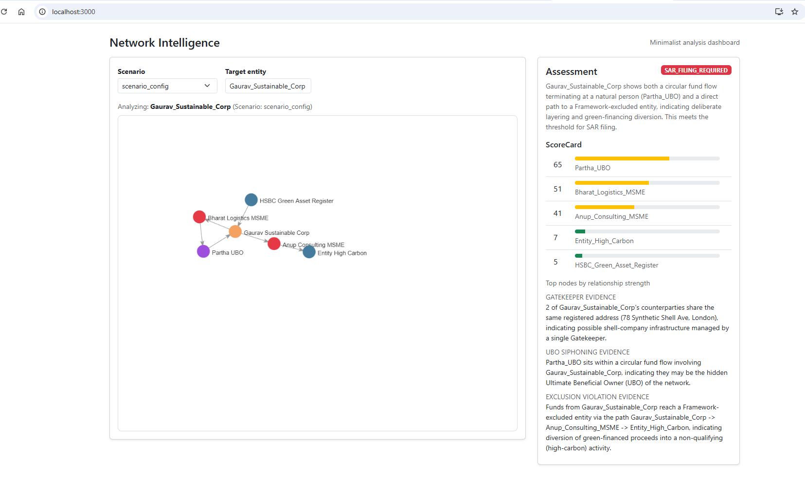

# Network Intelligence Framework

Lightweight project that builds directed counterparty networks from JSON scenarios, computes risk signals, runs a deterministic rules engine (optionally augmented with an LLM rationale), and exposes a ScoreCard showing how strongly each node in the graph relates to a chosen target entity.

This README explains how choosing a scenario changes the graph, how the ScoreCard is derived, and how the system produces an Assessment (e.g., SAR filing recommendation).

---

## Features
- Load scenario JSON files from `data/` and convert them to NetworkX DiGraphs
- Detect risk signals: circular fund flows, paths to Framework-excluded entities, shared registered-address density
- Worker agents identify roles: gatekeepers, mule/layerers, potential UBOs
- Deterministic orchestrator applies rules to return one of: `SAR_FILING_REQUIRED`, `ENHANCED_DUE_DILIGENCE`, or `NO_ACTION_REQUIRED`
- ScoreCard: per-node relationship strength (0–100) between the target entity and other nodes, with short human-readable reasons
- Frontend: minimal React UI that visualizes the graph and shows the Assessment + ScoreCard

---

## How it works (high level)

- Scenarios: each `data/<scenario>.json` contains `nodes` and `edges`. Nodes may include attributes such as `type`, `registered_address`, and `watchlist_hit`.
- Graph build: `backend/graph/build_graph.py` parses the JSON and builds a NetworkX DiGraph. Nodes are indexed by their `id`.
- Signals: `backend/graph/extract_signals.py` computes:
  - `circular_flow_detected` — cycles that include the target
  - `exposure_to_exclusion` — shortest path(s) from the target to any node with `watchlist_hit == "Framework_Exclusion"`
  - `shared_address_density` — how many downstream counterparties share the same registered address
- Workers: agent modules analyze the graph/signals to surface candidates:
  - `worker_gatekeeper` — shared-address clusters
  - `worker_mule` — nodes that forward and receive (pass-through)
  - `worker_ubo` — individuals in detected cycles
- Orchestrator: `backend/agents/orchestrator.py` runs signals + workers and deterministically computes the classification using rule logic. If `GEMINI_API_KEY` is provided, the orchestrator will ask the LLM to write a plain-language rationale but will never change the deterministic classification.
- ScoreCard: `backend/agents/scorecard.py` scores each node for relationship strength to the target using the signals and worker outputs. The score is deterministic and returned together with short reasons for transparency.

---

## ScoreCard explained

The ScoreCard is a list of `{ entity, score, reasons }` sorted by descending score. Example signals that increase score:

- UBO candidate in the same detected cycle — strong signal (+30)
- Participation in a circular flow (+20)
- Short path to a Framework-excluded node (scaled by inverse path length, up to +20)
- Shared registered-address with multiple downstream counterparties (scaled contribution)
- Flagged as gatekeeper or mule candidate (+15 / +10)
- Direct transaction edge to the target (+5)

Scores are intentionally deterministic and auditable so the system's outputs remain explainable. We recommend tuning weights to match operational thresholds.

---

## Assessment (classification)

The orchestrator applies simple, deterministic rules:
- If target has a circular flow AND UBO candidates AND exposure to an excluded entity → `SAR_FILING_REQUIRED`
- Else if any of (circular flow, gatekeeper, exclusion exposure) present → `ENHANCED_DUE_DILIGENCE`
- Else → `NO_ACTION_REQUIRED`

The LLM (if configured) only writes the human rationale for the decision; it cannot change the classification.

---
## UI Dashboard
•	
## Running locally

Prerequisites
- Python 3.10+ (3.14 tested in this workspace)
- Node.js 18+ and npm

Backend (FastAPI)

1. From repository root:

```powershell
python -m venv .venv
.\.venv\Scripts\Activate.ps1
python -m pip install --upgrade pip
pip install -r backend/requirements.txt
```

2. (Optional) Enable LLM rationale by creating `backend/.env` with:

```text
GEMINI_API_KEY=your_key_here
```

3. Start backend (from repo root):

```powershell
$env:PYTHONPATH = (Get-Location).Path
python -m uvicorn backend.main:app --reload --host 127.0.0.1 --port 8000
```

Frontend (React)

1. Install dependencies and start dev server:

```powershell
cd frontend
npm install
npm start
```

2. Open http://localhost:3000

API endpoints
- GET /sar-report/scenarios — list available scenario names (stem of `data/*.json`)
- GET /sar-report/{scenario}/{entity} — full SAR report including `signals`, `recommendation`, `role_analysis`, and `scorecard`

---

## Adding or editing scenarios

1. Place a JSON file in `data/` named `<your_scenario>.json`.
2. Schema expected by the graph builder:

```json
{
  "nodes": [{ "id": "NodeA", "type": "Company", "registered_address": "...", "watchlist_hit": "Framework_Exclusion" }],
  "edges": [{ "source": "NodeA", "target": "NodeB", "amount": 1000 }]
}
```

3. If the server is running, restart uvicorn or clear the `_graph_cache` to pick up changes.

---

## Tests

Run backend tests with pytest (after installing pytest):

```powershell
cd backend
python -m pip install pytest
pytest
```

Included tests exercise graph signal extraction and the ScoreCard smoke test.

---

## Troubleshooting

- "pip not recognized" — use `python -m pip ...` or add your Python Scripts folder to PATH. See earlier notes in the repo for exact commands.
- Uvicorn import errors (No module named graph) — ensure you run uvicorn from repository root and that `backend` is importable. Use:

```powershell
$env:PYTHONPATH = (Get-Location).Path
python -m uvicorn backend.main:app --reload
```

- Frontend: if Bootstrap import fails, run `npm install` inside the `frontend` folder and restart the dev server.

---

If you'd like, I can also:
- Add a configuration file for ScoreCard weights so non-developers can tune scores without touching Python code
- Add a dedicated API endpoint that returns only the ScoreCard (for faster UI updates)

Contact / Next steps
- Open an issue or request changes to weights, UI, or data schema. Contributions welcome.

